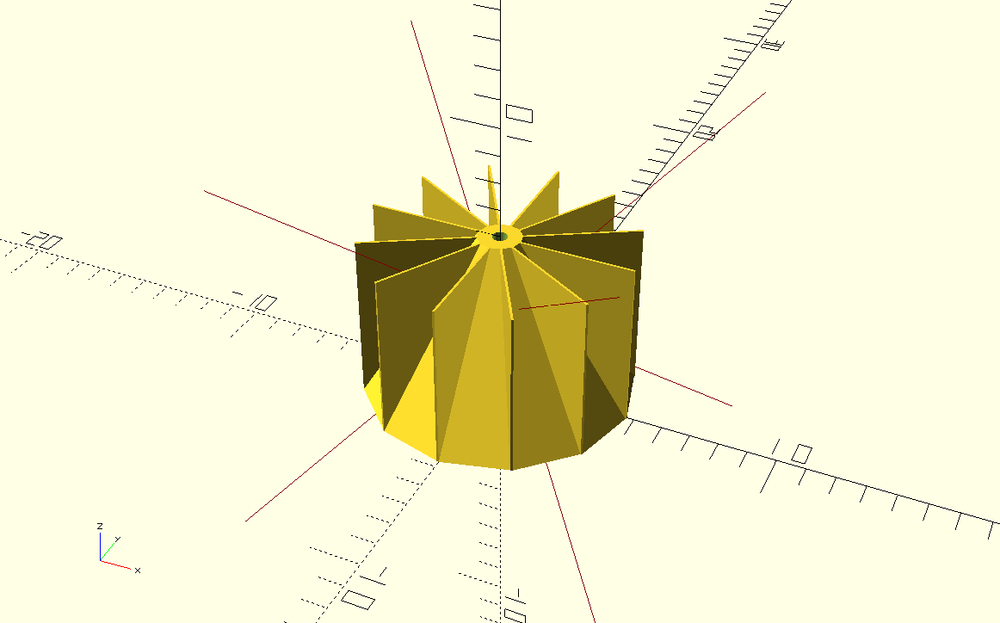

## What is this?
This is an automated pet food dispenser. My aging cat has a sensitive stomach so to keep her meals spaced out, I designed this dispenser.

## Compilation
Open each SCAD file with OpenSCAD, and press F6 to render the model. Export the renders as STLs for import into the slicer of your choice and printing.

